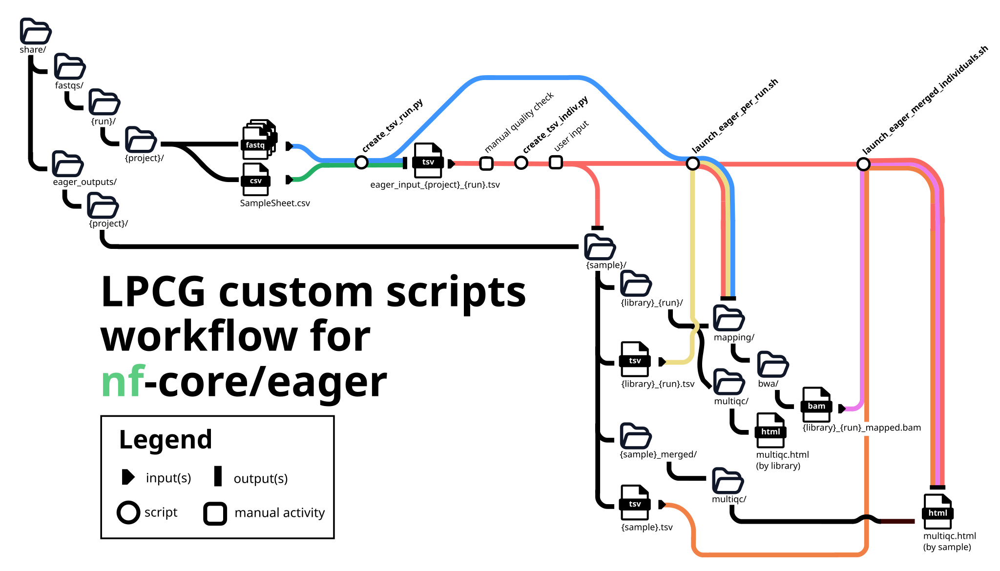

# <span style="color:#326273"> **Generate nf-core/eager input files using LPCG custom scripts** </span>

Flavia Leotta

Last updated: 25/06/2026

## Table of Contents
- [Introduction](#introduction)
  - [ What are nf-core/eager inputs and ouputs? ](#-what-are-nf-coreeager-inputs-and-ouputs-)
- [The four scripts](#the-four-scripts)
  - [  1. create\_tsv\_run.py ](#--1-create_tsv_runpy-)
  - [  2. create\_tsv\_indiv.py ](#--2-create_tsv_indivpy-)
  - [  Optional step: Fixing the files paths with `fix_paths.sh` ](#--optional-step-fixing-the-files-paths-with-fix_pathssh-)
  - [  3. launch\_eager\_per\_run.sh ](#--3-launch_eager_per_runsh-)
  - [  4. launch\_eager\_merged\_individuals.sh ](#--4-launch_eager_merged_individualssh-)
- [Additional files](#additional-files)
  - [ Configuration: `conf/lpcg_lib_params.yaml` ](#-configuration-conflpcg_lib_paramsyaml-)
  - [ SLURM script: `slurm_eager_profiles.sh` ](#-slurm-script-slurm_eager_profilessh-)
  - [ Configuration: `conf/lpcg_warsaw.config` and `conf/lpcg_human.config` ](#-configuration-conflpcg_warsawconfig-and-conflpcg_humanconfig-)

##  Introduction 

This tutorial refers to a set of four scripts available on the shared folder of the Laboratory of Paleogenetics and Conservation Genetics (LPCG), created with the intention of automatize and facilitate running the pipeline nf-core/eager (Fellows Yates J. A. _et al._, 2021) on sequencing results. Please refer to the pipeline extensive [documentation](https://nf-co.re/eager/2.5.1/) for more information about nf-core/eager functionalities.

### <span style="color:#5C9EAD"> What are nf-core/eager inputs and ouputs? </span>

To summarise, nf-core/eager is a pipeline created specifically for aDNA analysis that takes either `.fastq` or `.bam` files as inputs and produces a set of different, and customizable, outputs including reports on endogenous DNA percentage, damage estimation, contamination calculation, sex determination and more!

##  The four scripts 

The scripts I have prepared are intendend to be run in the following order:

1. [create_tsv_run.py](#-1-create_tsv_runpy-)
2. [create_tsv_indiv.py](#-2-create_tsv_indivpy-)
   1.  [Optional step: fix_paths.sh](#-optional-step-fixing-the-files-paths-with-fix_pathssh-)
3. [launch_eager_per_run.sh](#--3-launch_eager_per_runsh-)
4. [launch_eager_merged_individuals.sh](#--4-launch_eager_merged_individualssh-)



### <p style="background-color: #326273;"> <span style="color:white"> 1. create_tsv_run.py </span></p>

When running nf-core/eager on one library, it is possible to provide the path to the input files and a series of flags directly on the command line. One of the pipelines main features is, though, its ability to merge libraries at different levels (i.e. first at library level and then at sample[^sample] level) which is only possible if a `.tsv` input file is provided. An extensive description on what information is required in this `.tsv` input file can be found in the [documentation](https://nf-co.re/eager/2.5.1/docs/usage/#tsv-input-method) (which I'd advise to check for an explanation about the library merging process). This script parses a folder containing `.fastq` files and generates the `.tsv` input file with all or a subset of the samples in the folder: there are no mandatory flags, but if none is provided this script will make a few assumptions...

  Usage:
    
    create_tsv_run.py [additional flags]

  Output:
    
    eager_input_(ProjectName)_(FolderName).tsv

**Input/Output files**:
    
  - `--data`: `.csv` file that contains Lane information. The file must contain a row that starts with "[Data]" to be recognised. If none is provided, the script looks for it in the same folder as `--dir` and, next, in the parent folder of `--dir`.
  - `--dir`: directory where `.fastq` files are stored. Default: current working directory.

**Configuration options**:
  - `-c, --config`: path to `.yaml` file with projects parameters. Default: [`/mnt/workspace03/gr7001/share/conf/lpcg_lib_params.yaml`](#configuration-conflpcg_lib_params.yaml).
  - `-p, --project`: Project name(s). When providing more than one, separate them with a space. Extracts the parameters associated with the matching project(s) in the [`/mnt/workspace03/gr7001/share/conf/lpcg_lib_params.yaml`](#configuration-conflpcg_lib_params.yaml) configuration file and, if Sample_Project column in the **\-\-data** `.csv` file is found, select the subset of samples belonging to the selected project(s). Default: "global".
  - `-r, --run`: run name. Used to: 1) correct the Library ID by adding the run name at the end (this ensures that a Library sequenced more than once produces two unique outputs), 2) if provided, it will be the FolderName[^foldername] in the output `.tsv` file name.

**Script functionality options**:
    
  - `--dry-run`: Displays what the script would do but don't actually create the `.tsv` file.
  - `--ignore-samplesheet`: Ignore the `SampleSheet.csv`[^samplesheet] in the folder and use default parameters.

**nf-core/eager input options**: 
  
  These last flags are some of the information that an input `.tsv` file for nf-core/eager should include. This information is usually extracted from the configuration file [`/mnt/workspace03/gr7001/share/conf/lpcg_lib_params.yaml`](#configuration-conflpcg_lib_params.yaml), but those values can be overridden using these flags.
    
  - `--chemistry`: Illumina sequencer colour chemistry number.
  - `--seqtype`: paired end or single end data.
  - `--species`: species scientific name.
  - `--strand`: strandedness of the data.
  - `--udg`: UDG treatment information.

The script will create a .tsv file with the following columns:

| Column Name | Mandatory? | Description | Default | How the script obtains this information |
| :---------- | :--------: | :---------------------------- | :------ | :---------------------------------- |
| Sample_Name | Yes | A text string containing the name of a given sample of which there can be multiple libraries. | _None_ | A REGEX string[^regex] from [`conf/lpcg_lib_params.yaml`](#configuration-conflpcg_lib_params.yaml) is applied to the sample `.fastq` file name |
| Library_ID | Yes | A text string containing the name of a given library | _None_ | A second REGEX string from [`conf/lpcg_lib_params.yaml`](#configuration-conflpcg_lib_params.yaml) is applied to the sample `.fastq` file name |
| Lane | Yes | A number indicating which lane the library was sequenced on | 1 | The information is extracted from the Lane column in the `SampleSheet.csv` file |
| Colour Chemistry | No, unless Poly-G trimming is enabled | The number of colour chemistry used by the Illumina sequencer (2 for Next/NovaSeq, 4 for Hi/MiSeq) | 2 | Extracted from [`conf/lpcg_lib_params.yaml`](#configuration-conflpcg_lib_params.yaml) |
| SeqType | Yes | A text string ("PE"/"SE") indicating paired end or single end data | "PE" | Extracted from [`conf/lpcg_lib_params.yaml`](#configuration-conflpcg_lib_params.yaml) |
| Organism | No | A text string of the organism scientific name | "NA" | Extracted from [`conf/lpcg_lib_params.yaml`](#configuration-conflpcg_lib_params.yaml) |
| Strandedness | Yes | A text string indicating "single" or "double" strandedness | "single" | Extracted from [`conf/lpcg_lib_params.yaml`](#configuration-conflpcg_lib_params.yaml) |
| UDG_treatment | Yes | A text string indicating "full", "half" or "none" UDG treatment | "half" | Extracted from the sample `.fastq` file name using a REGEX name in the case of project[^project] "human", extracted from [`conf/lpcg_lib_params.yaml`](#configuration-conflpcg_lib_params.yaml) in the others |
| R1 | Yes if the inputs are `.fastq` files | A text string of a file path pointing to the forward reads file | _None_ | Extracted from the path in which the `.fastq` files are |
| R2 | No, unless SeqType is "PE" | A text string of a file path pointing to the reverse reads file | _None_ | Takes the R1 path and substitutes "R1" with "R2". WARNING: this is not validated (as in, the presence of the file is not checked), and could generate errors |
| BAM | No, unless the inputs are `.bam` files | A text string of a file path pointing to the `.bam` file. This is **incompatible** with columns R1 and R2, and should be set to NA when those column are not empty | "NA" | Simply always set to "NA" | 

### <p style="background-color: #326273;"> <span style="color:white"> 2. create_tsv_indiv.py </span></p>

> #### <span style="color:#E39774"> Warning</span>
> Before this step it is **highly** recommended to check the previous output file `eager_input_(ProjectName)_(FolderName).tsv` for any errors: it will be harder to correct anything downstream. Moreover, this file is used at every subsequent step, so it is important to not propagate any source of error.

As previously mentioned, the nf-core/eager pipeline is able to merge libraries on many levels and, because it follows the Nextflow syntax, it is able to parallelize processes and avoid rerunning analysis that have previously succeeded. Quite useful when libraries from the same Individual are sequenced in different moments: theoretically, a previously mapped library, shouldn't have to me re-mapped everytime. What we have noticed, though, is that if new samples are added to the input `.tsv` file, the pipeline is not able to recognise the previous samples as already cleaned and mapped, thus repeating, unnecessarily, these longer steps.

Since the sample merging happens after the mapping step (undoubtedly the most time consuming step), the solution we have found is to divide **every** library in its own folder, and then re-run eager for each Individual using the already mapped libraries' `.bam` files as the input. To do so, we have designed this folder structure:

```text
share/
└── eager_outputs/
    ├── global/
    └── {Project_Name}/
        └── {Sample_Name}/
            ├── {Library_ID}/
            ├── {Library_ID}.tsv
            ├── {Sample_Name}_merged/
            └── {Sample_Name}.tsv
```

The second script will take the previously created `eager_input_(ProjectName)_(FolderName).tsv` file and will:

- locate the correct ProjectName folder;
- create the folders and/or `{Library_ID}.tsv` files that do not exist already;
- update any existing `{Sample_Name}.tsv file`, by appending the new libraries information.

Only the input file is required, the rest of the information is extracted from the file name.

  Usage:

    create_tsv_indiv.py --input <tsv_input_file> [additional flags]

  Output:

    many folders and .tsv files as described earlier

**Input/Output files**:
    
  - `-i, --input`: path to the `eager_input_(ProjectName)_(FolderName).tsv` (or any other `.tsv` file with the same structure). This flag is required.
  - `-o, --outdir`: path to the output directory. If not provided, it will try to extract the ProjectName from the input `.tsv` file: if no ProjectName will be found, it will output the results in the `global/` folder. This folder is meant to be **temporary** and serve only to manually re-assign the correct location to each ouput. Do not keep there any folder or file for an indeterminate amount of time. If an **\-\-outdir** is provided but doesn't match the extracted ProjectName, it will throw a warning.

**Configuration options**:

  - `-r, --run`: sequencing run ID used to substitute the Illumina suffix "_SXXX" with the run ID, ensuring that the same library sequenced twice will produce two distinct outputs. This flag is an artefact of when the previous script did not allow for such correction, but now it is not necessary if this correction was already performed in the previous script.

**Script functionality options**:

  - `-y,--yes`: The script will print a preview and ask the user if all the information is correct. The user has to type "Y" or "YES" to proceed, but if this flag is provided it will not require the manual check.

The library-specific `{Library_ID}.tsv` files will be composed by only two rows: the header, and the row corresponding to that Library_ID in the `eager_input_(ProjectName)_(FolderName).tsv` file. Then, the same row is appended to `{Sample_Name}.tsv file`: the only differences are that the "R1" and "R2" columns will be set to "NA", the "SeqType" will be always converted to "SE" and the "BAM" column will have the `{Library_ID}.bam` file path. To not worry if the `{Library_ID}.bam` was still not created at this stage: it is expected, the path is generated simply because the output folder structure is known.

>#### <span style="color:#E39774"> Bonus: Pipying the first two scripts </span>
>
>The two scripts can be run one right after the other by launching this command from the directory where the `.fastq` files are stored:
>
> `/mnt/workspace03/gr7001/share/scripts/tsv_input_parser.py -i $(/mnt/workspace03/gr7001/share/scripts/create_tsv_run.py)`

### <p style="background-color: #326273;"> <span style="color:white"> Optional step: Fixing the files paths with `fix_paths.sh` </span></p>

In the case that `.fastq` files are moved from a folder to another (for example, your output was created in the "global" folder and you move it to your personal project's folder) this script allows you to easily change the R1, R2 and BAM columns of all generated `.tsv` files.

  Usage:

    fix_path.sh -o <old_path> -n <new_path> [-p file_pattern]

  Output:

    corrected .tsv files

**Input/Output files**:
    
  - there are no input files: the script will parse the working directory.

**Script functionality options**

  - `-o`: full of part of the old path to change.
  - `-n`: new path.
  - `-p`: `.tsv` file pattern (Default: "\*.tsv"). This allows to restrict the edits to a specific Library (i.e. "LibraryID.tsv"), to a subset of libraries belonging to a specific Sample (i.e. "SampleName\*.tsv") or a subset of libraries sequenced during a specific sequencing run (i.e. "\*NR103SS.tsv").

### <p style="background-color: #326273;"> <span style="color:white"> 3. launch_eager_per_run.sh </span></p>

>#### <span style="color:#E39774"> Warning </span>
>
>This script expects that the `.tsv` files and the output directories divided by Sample_Name and Library_ID are already created: if it will not find the correspponding files/folder it will **not** create them nor perform the analysis. 

Now that all input files and directories are ready, we can launch nf-core/eager for all the Libraries! The next script requires only one flag (the previously created `eager_input_(ProjectName)_(FolderName).tsv` file).

  Usage:

    launch_eager_per_run.sh -i <tsv_input_file> [additional flags]

  Output:

    - all nf-core/eager outputs...
    - ...but the most important is each library's `LibraryID_mapped.bam` file

**Input/Output files**:
    
  - `-i`: path to the previously generated `eager_input_(ProjectName)_(FolderName).tsv` file.
  - `-o`: output directory where your sample folders are saved (ex. eager_outputs/human/). If not provided, the script will try to extract the ProjectName from the input file and will look for the project folder. If not found, it will use the global folder.

**Script functionality options**

  - `-s`: path to the SLURM script to launch one instance of nf-core/eager. Default: [`slurm_eager_profiles.sh`](#-slurm-script-slurm_eager_profilessh-).
  - `-r`: sequencing run ID used to substitute the Illumina suffix "_SXXX" with the run ID, ensuring that the same library sequenced twice will produce two distinct outputs. Again, this flag is an artefact and it is not necessary if this correction was already performed in the previous steps.
  - `-c`: Configuration file for nf-core/eager. The available configuration files are in the shared folder `conf/`. Default: temporarly, is [`lpcg_human`](#-configuration-conflpcg_warsawconfig-and-conflpcg_humanconfig-).
  
This script will schedule one SLURM job for each `.tsv` file, using the SLURM script provided with the `-s` flag: it does not notify the user if a job started nor if it has failed, so it is advisable to regularly check the scheduled jobs queue (command `squeue`). From experience, if the job starts and finishes in less than 12-14 seconds, there was a problem with the input file, so make sure to check the hidden `.nextflow.log` files for more information.

> #### <span style="color:#E39774">Shameless self-promo</span>
>
> <table>
> <tr>
> <td width="80" valign="top">
>   
> </td>
> <td valign="top">
> 
> Do you want a visual representation of the state of all nodes in the server (CPU, available memory, users occupying them)? Do you want to periodically check your scheduled and running analyses but you're tired of typing `squeue` every few minutes?
> </td>
> </tr>
> </table>
> 
> Look no further, because I created a little Command Line Interface (CLI) tool called [Oposqueue](https://github.com/flavialeotta/opoSqueue.git) which is installable in less than 3 minutes and takes care of its own dependencies. And it also has a cute interface.

### <p style="background-color: #326273;"> <span style="color:white"> 4. launch_eager_merged_individuals.sh </span></p>

The last step will allow the user to merge the libraries by Sample Name: the idea is to run this step everytime you sequence a new library for a Sample, as you will gather more reads and, potentially, new source of information or statical power. This script takes advantage of the fact that each library has already been independently mapped to the reference genome: by using the `.bam` files as input, all preprocessing steps until mapping are skipped. Since most downstream analyses (such as sex estimation or genotyping) are relatively fast, rerunning them after adding a new library is generally practical.

  Usage:

    launch_eager_merged_individuals.sh -i <input> [additional flags]

  Output:

    - complete nf-core/eager outputs for each Sample

**Input/Output files**:
    
  - `-i`: the script input, either a path or a text file. This script operates slightly differently in comparison to the previous one, as it allows two types of inputs:
    - PATH: If you want to run this analysis on **ALL the Samples associated with a project**, you can provide a **path** to the project directory;
    - TEXT FILE: If you want to limit the analysis to a **subset of Samples**, you can provide:
      - a **tsv** file, namely `eager_input_(ProjectName)_(FolderName).tsv`. The script extracts the project name from the filename and searches for the corresponding Sample directories in:
  
        `/mnt/workspace03/gr7001/share/eager_outputs/{project}/`
        
        If the project directory cannot be determined, it falls back to:
        
        `/mnt/workspace03/gr7001/share/eager_outputs/global/`
      - a **csv** or **txt** file containing one Sample Name per line (no paths required). In this case, the script assumes that either:
        - the file is located in the same directory as the Sample folders, or
        - the script is executed from that directory. 
          
        For example, if you want to run the analysis in the "human" project, your Samples_Subset.txt file should be in the human/ folder, and your overrall folder structure should resemble this:
      
            share/
            └── eager_outputs/
                └── human/
                    ├── Samples_Subset.txt
                    ├── {Sample_Name1}/
                    ├── {Sample_Name2}/
                    └── .../

**Configuration options**:

- `-s`: path to the SLURM script to launch one instance of nf-core/eager. Default: [`slurm_eager_profiles.sh`](#-slurm-script-slurm_eager_profilessh-).
- `-c`: Configuration file for nf-core/eager. The available configuration files are in the shared folder `conf/`. Default: temporarly, is [`lpcg_human`](#-configuration-conflpcg_warsawconfig-and-conflpcg_humanconfig-).

## Additional files

I have prepared some additional files. These are not editable but I can modify them to better accomodate your analyses' needs. With the assumption that the shared folder is available at path `/mnt/workspace03/gr7001/share/`:

1. Configuration file [`conf/lpcg_lib_params.yaml`](#configuration-conflpcg_lib_params.yaml)
2. SLURM script [`slurm_eager_profiles.sh`](#-slurm-script-slurm_eager_profilessh-)
3. Configuration files [`conf/lpcg_warsaw.config` and `conf/lpcg_human.config`](#-configuration-conflpcg_warsawconfig-and-conflpcg_humanconfig-)

### <span style="color:#5C9EAD"> Configuration: `conf/lpcg_lib_params.yaml` </span>

This file contains information on how we name our samples and other parameters (i.e. UDG treatment) we use to create the nf-core/eager input `.tsv` file. There are global settings which include default values (known to be common within our samples) and "most likely" fallbacks (for example, most commonly used sample naming conventions), and there are settings specific for each project. The file is readable by everyone in the group, but editable only by me: if you wish to add your project-specific settings, please contact me in office or by e-mail.

These are the global settings which, again, can be overridden by passing specific flags to the [create_tsv_run.py](#-1-create_tsv_runpy-) script:
|      |    |
|------| -- |
| Lane | 1 |
| Colour_Chemistry | 2 |
|SeqType | PE |
|Organism | NA |
|Strandedness |single |
|UDG_Treatment | half |
|sample_id_regex | "^([A-Za-z]+\\\d+)" |
|library_id_regex | "^(.*?)\_R[12]\_\\\d+$" |

Additionally, the human project presents a udg_regex to be able to extract the UDG treatment information from the Library ID: if you are interested in adding project-specific parameters, feel free to contact me!

### <span style="color:#5C9EAD"> SLURM script: `slurm_eager_profiles.sh` </span>

This script allows the user to run nf-core/eager for a single `.tsv` file: in the context of this tutorial, no additional details are needed, since it is internally ran and flags are passed through the other scripts. A description of its flags and functionalities is available on our [Institutional Github](https://github.com/LPCG-ancientDNA-Warsaw/nfcore-eager-LPCG/blob/29c02be20fb59bea58c685706938f3c103c39795/slurm_job_tutorial.md).

### <span style="color:#5C9EAD"> Configuration: `conf/lpcg_warsaw.config` and `conf/lpcg_human.config` </span>

At the moment, there are only two available configuration settings (sometimes called profiles[^profile] in my scripts): the laboratory-specific nf-core/eager configuration file (`conf/lpcg_warsaw.config`) and a human-analysis specific one (`conf/lpcg_human.config`). The latter expands the parameters set in the Laboratory configuration with specific human-related reference genome, bwa index, and more information. Currently, the Laboratory use of nf-core/eager is limited to human analysis, thus the profile "lpcg_human" is the default behaviour, but once nf-core/eager will be used by more researchers, we expect to change these settings to:

- make "lpcg_warsaw" the default setting;
- create new profiles for each type of analysis, potentially one for each specific species studied, or researcher.

The **Laboratory** configuration settings personalise the number of CPUs used for medium-size multi-core processes (specifically mapping with bwa) and the memory allocated to the process "damageprofiler", which has previously created some problems.

The **human** configuration setting inherits the previous parameters, but also enables the sex determination, nuclear contamination estimation and genotyping steps, which are disabled in the default nf-core/eager pipeline. Moreover, it also provides the path to the human reference genome, the path to its bwa index (in `references/`) and the path to the 1240K SNPs panel (in `genotyping/`).

[^project]: A **project** is the name of the research project to which each sample is associated to. It is one of the column names in the `SampleSheet.csv` file that accompanies each sequencing run.
[^regex]: A **Regex**  string is a sequence of characters that defines a search pattern, used to match, search, or manipulate text based on specific criteria (https://en.wikipedia.org/wiki/Regular_expression).
[^sample]: By **sample**, nf-core/eager is referring to an individual. For example, if we collected the bone powder from a femur and from a phalanx of individual 1, the individual 1 will be the Sample (the femur and phalanx will be different libraries of the same Sample).
[^samplesheet]: The **SampleSheet** `.csv` file is a text file with information about the sequencing run. It can be found in each sequencing run folder in `/mnt/workspace03/gr7001/share/fastqs/`.
[^foldername]: **FolderName** is used to uniquely associate an input `.tsv` file with each sequencing run. Ideally, this folder name will be the Sequencing Run ID (NRXXXAA) that is either provided by the user or found when parsing the working directory path. If nothing matches our Sequencing Run ID naming convention, it will simply be the name of the folder where `.fastq` files are stored.
[^profile]: A configuration file that is approved by and available on nf-core is called a **profile**. The goal is to create a profile for the LPCG laboratory once we agree on a set of parameters, and send it to nf-core for approval: this way we will not need to store the configuration files on the server, but they will be available through GitHub.
